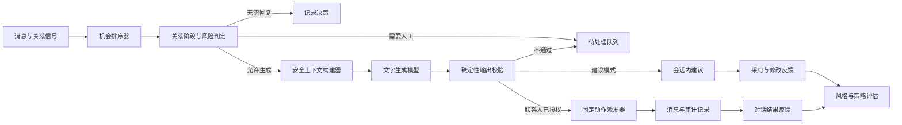

# Z 属性关系优先聊天 Agent 设计

## 1. 文档状态

- 设计对象：当前 Web 应用中的 Z 属性账号聊天 Agent。
- 数据基线：2026-07-27 生产数据库只读聚合快照。
- 设计目标：把现有“自动社交执行器”收敛为“关系优先的聊天副驾”。
- 实施原则：模型只生成文字；是否生成、是否回复、是否发送、发送给谁均由确定性代码决定。
- 既有边界：继续复用现有三层授权、固定动作白名单、任务幂等、租约、预算、失败停机和最终派发门禁。

本文不要求模型获得任意工具调用、浏览器自动化、Cookie、Token、密码、完整用户资料或原始上游响应。

## 2. 数据结论与产品定位

### 2.1 数据摘要

当前样本只有 7 个账号，不适合训练面向全体用户的统一人格。其中 Z 账号贡献了主要行为数据：

| 指标 | Z 账号聚合结果 | 设计含义 |
|---|---:|---|
| 归档消息 | 约 8,700 条 | 可以建立个人表达与关系模型 |
| 会话 | 235 个，其中 166 个有消息 | 需要区分空会话、冷触达和真实关系 |
| 近 7 天活跃会话 | 84 个 | 核心问题是注意力分配，不是缺少候选人 |
| 深度会话 | 14 个会话贡献 79.8% 消息 | 应优先维护少量重要关系 |
| 当前关系记录 | 522 条 | 需要统一关系阶段和去重触达规则 |
| 被访问事件 | 309 次 | 应优先处理入站意向 |
| 收到好友申请事件 | 292 次 | 不应把冷启动获客作为首要目标 |
| 发出消息中位长度 | 4 字 | 回复应短，但必须有实际语义 |
| 入站轮次中位回复时间 | 约 38 秒 | 生成、等待和派发需要符合真实节奏 |
| 自动主动私信 | 6 次，4 次在 24 小时内获回复 | 冷启动有价值，但样本过小且必须低频 |
| 自动上下文回复 | 6 次成功发送，仅 1 次继续对话 | 当前自动回复质量和关系适配不足 |

### 2.2 产品结论

Z Agent 的第一目标不是持续寻找新用户，而是按以下顺序分配注意力：

1. 处理尚未回复的有效入站消息。
2. 处理好友申请、访问记录等高意向信号。
3. 维护已经形成双向互动的稳定关系。
4. 在没有高优先级事项时，低频发现兼容的新用户。

因此默认产品形态应为“会话内建议 + 按联系人授权的自动回复”，而不是全局开启后对所有联系人自动发送。

## 3. 目标与非目标

### 3.1 目标

- 保持 Z 账号短句、直接、自然的表达习惯。
- 防止把某个深关系中的称呼、调侃和笑声复制给其他联系人。
- 优先处理高意向入站关系，减少无效群发。
- 对候选用户执行性别、属性、年龄、关系和历史触达硬门禁。
- 在消息连发时等待完整语义，再生成一次回复。
- 让用户能按联系人选择“仅建议”“允许自动回复”“始终人工处理”。
- 所有自动动作可解释、可审计、可立即暂停。

### 3.2 非目标

- 不做任意站内操作的通用 Agent。
- 不自动修改个人资料、实名、支付、群组或媒体内容。
- 不根据 Z/B/双属性自动推断亲密关系、性偏好、支配关系或同意状态。
- 不让模型自行决定关注、好友申请、私信对象或发送时机。
- 不把全部历史、完整 `users.profile` 或原始上游响应交给模型。
- 不以动作次数作为主要成功指标。

## 4. 总体架构

### 4.1 组件职责

| 组件 | 职责 | 是否允许模型参与 |
|---|---|---|
| 机会排序器 | 汇总新消息、好友申请、访问、已有关系和新候选 | 否 |
| 关系判定器 | 计算关系阶段、待回复状态、兼容性和风险 | 否 |
| 上下文构建器 | 只读取白名单字段、联系人记忆和当前会话 | 否 |
| 文字生成器 | 生成一条候选回复或开场白 | 是，仅生成文字 |
| 输出校验器 | 检查称呼、笑声、联系方式、敏感内容和长度 | 否 |
| 派发器 | 复用固定动作执行边界发送消息 | 否 |
| 反馈评估器 | 记录采用、修改、回复和续聊结果 | 否 |

## 5. 关系状态机

关系阶段必须按联系人保存，不能只依赖全局画像。

| 阶段 | 初始判定 | 默认模式 | 表达边界 |
|---|---|---|---|
| `new` 陌生 | 无双向消息，或只有一次外发 | 仅建议 | 不使用昵称、笑声、亲密或角色表达 |
| `engaged` 初步互动 | 已有双向消息，消息总量少于 20 | 仅建议；用户可单独开放低风险自动回复 | 一次推进一个话题，允许轻度跟随语气 |
| `established` 稳定关系 | 消息总量 20 至 99，近期持续双向互动 | 可按联系人开放自动回复 | 可使用该联系人上下文中已确认的称呼 |
| `close` 深关系 | 消息总量至少 100，或用户手动标记 | 可按联系人开放自动回复 | 允许联系人专属表达，但仍受边界检查 |
| `manual_only` 始终人工 | 用户指定，或存在高风险主题 | 不调用自动发送 | 只显示风险提示和可选草稿 |
| `inactive` 暂停触达 | 外发长期未回复、被拒绝、被拉黑或会话不可用 | 不再主动触达 | 只有新入站消息才能重新评估 |

消息数量只是初始启发式规则。用户手动设置始终优先，关系状态不能仅由模型推断。

### 5.1 状态转换

- `new -> engaged`：对方在首次外发后返回一条有效入站消息。
- `engaged -> established`：达到消息量阈值，且最近 7 天存在双向互动。
- `established -> close`：达到深度阈值，或用户主动标记为重要联系人。
- 任意阶段 `-> manual_only`：用户设置，或命中资金、精确位置、联系方式、冲突、健康、法律、身份承诺、露骨内容或无法理解的媒体。
- 任意阶段 `-> inactive`：对方被拉黑、账号不可用、存在未回复外发消息超过设定时间，或用户选择停止触达。
- `inactive -> engaged`：对方重新发送有效入站消息，且未命中阻断关系。

## 6. 机会排序与候选门禁

### 6.1 机会排序

确定性排序建议如下：

| 信号 | 基础优先级 |
|---|---:|
| 新的有效入站消息 | 100 |
| 收到好友申请 | 80 |
| 已有稳定关系的新活动 | 70 |
| 访问过本人且资料兼容 | 50 |
| 文字匹配成功 | 40 |
| 在线列表新候选 | 20 |

在基础优先级上再应用：

- `close` 联系人加 20。
- `established` 联系人加 10。
- 最近 24 小时已处理过减 30。
- 存在未回复外发消息直接排除主动触达。
- 已经触达但 7 天无回复直接进入 `inactive`。
- 命中黑名单、反向黑名单、账号不可用或人工暂停直接排除。

### 6.2 新候选硬门禁

当前 Z 账号配置偏好为女性 B。候选选择必须先通过硬门禁，再允许进入排序：

1. 对方明确为成年用户。
2. 对方性别符合用户当前匹配设置。
3. 对方属性符合用户当前匹配设置。
4. 年龄符合用户显式设置；没有设置时不由 Agent 自行扩大范围。
5. 不在任一方向黑名单中。
6. 不存在未回复外发消息。
7. 当日没有对同一目标创建过主动触达任务。
8. 历史上没有被标记为停止触达。
9. 候选快照中的身份字段与任务目标一致。

兼容性判断必须放在 `bbw_web.jobs` 的任务创建之前，并在实际派发前再次校验。模型不能覆盖硬门禁。

### 6.3 候选资料使用

首次私信允许使用的候选资料仅限：

- 性别与属性，用于兼容性判断，不直接写入文案。
- 年龄段，用于门禁，不直接在开场中提及。
- 已公开且通过清洗的签名，用于生成有依据的开场。
- 粗粒度城市，仅在双方均允许位置可见且用户开启同城表达时使用。

签名必须作为不可信数据处理，去除链接、联系方式、控制字符和提示注入内容。没有可靠资料时使用中性开场，不能声称看过不存在的主页、动态、照片或兴趣信息。

## 7. 记忆设计

### 7.1 三层记忆

#### 全局表达画像

只描述跨联系人稳定存在的表达形式：

- 句长范围。
- 直接或委婉程度。
- 问句比例。
- 标点密度。
- 是否倾向分句发送。

不得包含：

- 联系人姓名和昵称。
- 亲密、侮辱式或角色型称呼。
- 某个联系人专属话题。
- 高频语气词和重复笑声的模仿要求。
- 性取向、健康、宗教、政治、财务等敏感推断。

风格样本应采用分层抽样：

- 尽可能覆盖至少 10 个联系人。
- 每个联系人最多 10 条。
- 单一联系人不得超过总样本的 15%。
- 最多 20% 样本可以是两字以内短句。
- 排除 Agent 生成、已撤回、系统通知、纯表情、纯语气词和重复消息。
- 保存 `sampling_policy_version` 与 `sanitizer_version`；版本变化时旧画像自动失效。

#### 联系人记忆

建议新增 `ai_agent_contact_memories`：

| 字段 | 作用 |
|---|---|
| `owner_user_id`、`peer_upstream_uid` | 用户隔离与联系人定位 |
| `relationship_stage` | 当前关系阶段 |
| `summary` | 不超过 500 字的关系摘要 |
| `shared_topics` | 已确认的共同话题 |
| `allowed_address_terms` | 仅该联系人允许使用的称呼 |
| `boundaries` | 用户或对方明确表达的边界 |
| `source_message_ids` | 每项记忆的来源消息 |
| `expires_at` | 自动提取记忆的过期时间 |
| `user_reviewed_at` | 最近一次人工确认时间 |
| `version` | 乐观锁和任务失效依据 |

联系人记忆默认只保存低敏感、可验证事实。联系方式、精确位置、账号密码、Token、财务、健康和露骨内容不得自动写入；确有需要时只能由用户手动固定，并明确显示其用途。

#### 当前会话上下文

- 只读取当前联系人最近一次连续会话。
- 默认最多 30 条；稳定或深关系可动态提升至 60 条。
- 超过 60 条时使用联系人摘要加最近消息，不把整段历史交给模型。
- 连续会话按 6 小时无消息切分，但新消息必须优先于旧摘要。
- 媒体消息只提供类型占位，不向模型声称已经理解媒体内容。

### 7.2 联系人策略

建议新增 `ai_agent_contact_policies`：

| 字段 | 作用 |
|---|---|
| `mode` | `suggest_only`、`auto_low_risk`、`manual_only` |
| `stage_override` | 用户手动覆盖关系阶段 |
| `paused` | 临时停止此联系人 Agent |
| `minimum_reply_delay_seconds` | 最小回复等待 |
| `maximum_reply_age_seconds` | 最晚允许自动回复的消息年龄 |
| `allow_address_terms` | 用户确认的称呼白名单 |
| `version` | 策略变化后取消旧任务 |

默认值必须为 `suggest_only`。

## 8. 回复决策

### 8.1 调用模型前的确定性判断

以下情况直接返回 `no_reply`，不调用模型：

- 纯表情、纯系统通知或已撤回消息。
- “好”“收到”“晚安”等明确结束语，且没有新问题。
- 已经存在更晚的入站或外发消息。
- 消息超过自动回复有效期。
- 同一联系人存在未完成任务。

以下情况返回 `manual_required`：

- 图片、视频、文件或没有可靠转写的语音。
- 资金、支付、转账、借款或商业交易。
- 精确位置、线下见面细节、手机号和其他平台联系方式。
- 健康、法律、身份承诺、威胁、冲突或举报。
- 露骨内容、角色边界或同意状态不明确。
- 要求模型编造个人经历、关系、位置或承诺。

只有剩余低风险文本消息才进入生成阶段。

### 8.2 不同关系阶段的文字策略

| 阶段 | 建议长度 | 问句 | 笑声与语气词 | 称呼 |
|---|---:|---|---|---|
| `new` | 6 至 16 字 | 最多一个具体问题 | 不使用 | 不使用 |
| `engaged` | 4 至 16 字 | 按上下文决定 | 最多一个，不得位于句首 | 默认不使用 |
| `established` | 3 至 14 字 | 自然承接 | 最多一个 | 仅限联系人白名单 |
| `close` | 2 至 14 字 | 跟随真实节奏 | 可跟随上下文，但不得连续重复 | 仅限联系人白名单 |

所有阶段均要求回复至少包含一个实际语义，不得只输出笑声、语气词或无信息重复。

### 8.3 Z 属性表达边界

- Z 仅作为匹配兼容字段和用户自我描述，不自动转化为控制、命令或亲密语气。
- 陌生和初步互动阶段不得主动把话题引向角色或轻度 SM。
- 只有对方在当前连续会话中明确提及相关话题，且不存在拒绝、犹豫或边界不明时，才可生成克制的澄清式回复。
- 对方的同意、拒绝和边界必须存为联系人级记忆，不能迁移到其他联系人。
- 任何涉及线下行为、安全词、身体边界或风险活动的内容均转人工处理。

## 9. 生成与输出校验

### 9.1 模型输入

模型只接收：

- 本次生成目标。
- 当前关系阶段。
- 安全处理后的全局表达画像。
- 当前联系人的低敏感记忆。
- 当前连续会话的文字上下文。
- 当前联系人允许使用的称呼。
- 用户配置的写作要求。

模型不得接收：

- 完整 `users.profile`。
- `raw_upstream_responses`。
- 手机号、密码、Token、Cookie、设备数据和客户端 IP。
- 精确经纬度。
- 其他联系人的消息、称呼和记忆。

### 9.2 模型输出

模型继续只返回纯文本。回复、跳过和人工接管决策由调用模型前的确定性策略给出，避免模型获得动作选择权。

### 9.3 确定性输出校验

生成文字必须依次通过：

1. 非空和长度检查。
2. 链接、手机号、邮箱、密钥和 Token 模式检查。
3. 未授权联系人称呼检查。
4. 句首语气词、长笑声、重复笑声和多重语气词检查。
5. 陌生人亲密表达检查。
6. 虚构资料、共同经历、同城或主页内容检查。
7. 当前会话是否仍为最新消息检查。
8. 联系人策略和全局授权是否仍有效检查。

任何一项失败均不得自动重写后直接发送。建议模式可以返回“需要重新生成”，自动模式则取消任务并进入人工队列。

## 10. 时间与节奏

### 10.1 消息连发等待

Z 账号连续入站消息的中位间隔约 7 秒，约 89% 的连续消息在 30 秒内到达。因此：

- 收到新入站后默认等待 30 秒。
- 等待期间又收到消息则重新计时。
- `close` 联系人可配置为 15 秒，但不得低于 10 秒。
- 消息变化期间已经开始的生成必须标记为 stale，不得发送旧回复。

### 10.2 回复节奏

- `new`：仅建议，不自动发送。
- `engaged`：建议延迟 30 至 90 秒。
- `established`：建议延迟 20 至 60 秒。
- `close`：建议延迟 15 至 45 秒。
- 模型生成超过 30 秒后若上下文发生变化，直接取消。
- 不通过发送多条短消息模拟真人；一次任务只发送一条完整文本。

### 10.3 活动窗口

基于当前行为，Z 账号的推荐初始时区和活动窗口为：

- 时区：`Asia/Shanghai`。
- 活动窗口：08:00 至次日 00:30。
- 00:30 至 08:00 默认不主动触达。
- 安静时段收到消息时进入待处理队列，是否允许自动回复由联系人策略单独决定。

这些值必须允许用户修改，不能从行为数据永久锁定。

### 10.4 新用户触达预算

- 第一阶段关闭自动冷启动私信。
- 后续开放时，每日最多 3 至 5 个新联系人。
- 同一联系人只允许一次冷启动消息。
- 没有回复时不追发、不关注、不追加好友申请。
- 兼容性错误目标必须为零。

## 11. 用户界面

所有界面操作使用文字按钮和状态文本，不使用 Emoji、小表情、单字符或缩写模拟图标。

### 11.1 会话内聊天副驾

在消息输入框上方增加：

- `生成建议`
- `换一种表达`
- `采用`
- `不回复`
- `始终人工处理`

同时显示：

- 当前关系阶段。
- 本次使用的上下文条数。
- 当前允许使用的称呼。
- 是否命中风险边界。
- 当前联系人模式：仅建议、允许低风险自动回复、始终人工。

建议正文始终先进入输入框，由用户编辑后发送；只有联系人已单独授权 `auto_low_risk` 时才允许走后台派发。

### 11.2 待处理中心

新增按优先级排序的文本列表：

- `等待回复`
- `好友申请`
- `高意向访问`
- `需要人工检查`
- `可考虑的新联系人`

每项显示关系阶段、最后活动时间和进入队列的原因，不显示不必要的内部任务编号。

### 11.3 Agent 控制中心

保留现有运行概览、能力与节奏、模型与表达三个菜单，但调整统计内容：

- 建议采用率。
- 采用前修改率和平均修改幅度。
- 24 小时有效回复率。
- 三轮续聊率。
- 未回复冷启动数量。
- 人工接管数量及原因。
- 不兼容候选拦截数量。
- stale 生成数量。
- 模型延迟中位数与高分位数。

浏览、匹配和发送次数只作为运行明细，不作为主要成功指标。

## 12. API 与数据模型建议

### 12.1 复用接口

现有回复草稿服务可以复用为会话内建议能力，但不恢复通用账号操作表单。建议将回复草稿入口直接绑定到当前会话，而不是要求用户输入目标用户编号。

### 12.2 新增接口

| 接口 | 作用 |
|---|---|
| `GET /api/agent/opportunities` | 返回当前用户的排序后待处理事项 |
| `GET /api/agent/conversations/{peer}/assist-status` | 返回关系阶段、联系人策略和可用能力 |
| `POST /api/agent/conversations/{peer}/suggest` | 为当前最新消息生成一条建议 |
| `POST /api/agent/conversations/{peer}/suggestion-feedback` | 记录采用、放弃、换写和发送前修改幅度，不保存最终消息正文 |
| `PUT /api/agent/conversations/{peer}/policy` | 保存联系人模式和人工覆盖阶段 |
| `GET /api/agent/conversations/{peer}/memory` | 返回可供用户核对的联系人记忆 |
| `PUT /api/agent/conversations/{peer}/memory` | 允许用户修正或删除联系人记忆 |

所有接口必须从登录 Session 获取 owner，不接受客户端提交 owner_user_id。

### 12.3 数据迁移

建议按顺序增加：

1. `ai_agent_contact_policies`。
2. `ai_agent_contact_memories`。
3. `ai_style_profiles` 的采样策略版本、清洗版本和覆盖联系人数量。
4. Agent 任务上的关系阶段、决策代码和上下文摘要哈希。

新增表和字段必须用户隔离、支持级联删除，并加入敏感字段序列化保护。

## 13. 对现有代码的落点

| 文件 | 调整方向 |
|---|---|
| `bbw_agent/services.py` | 分层风格抽样、安全会话上下文、联系人记忆构建 |
| `bbw_agent/autonomous.py` | 关系阶段、决策代码、等待窗口和联系人策略 |
| `bbw_agent/runtime.py` | 分阶段提示词、联系人安全上下文和输出校验 |
| `bbw_agent/repositories.py` | 联系人策略、记忆、候选过滤和反馈统计仓储 |
| `bbw_agent/api.py` | 会话内建议、联系人策略、记忆核对和机会列表接口 |
| `bbw_web/jobs.py` | 兼容性硬门禁、机会排序、消息连发等待和二次校验 |
| `bbw_prod/models.py` | 联系人策略、联系人记忆和风格版本字段 |
| `bbw_web/static/app.js` | 会话内建议条、待处理中心和联系人级 Agent 控制 |
| `bbw_web/static/app.css` | 文本按钮、状态标签和响应式布局 |
| `tests/` | 跨联系人隔离、兼容性、stale、节奏、隐私和 UI 合约 |

## 14. 隐私与安全要求

生产快照中，7 个用户的 `profile` JSON 仍保留手机号、密码和 Token 等字段键；本次核查时对应值均为 `[REDACTED]`，没有发现这些字段中保存明文凭据。即使如此，继续保留凭据形状的占位键会扩大误用与攻击面，部分资料还包含经纬度与客户端 IP，因此必须把入库清洗和模型字段白名单列为 P0，而不是只依赖提示词约束。

### 14.1 入库清洗

禁止进入 `users.profile` 的字段至少包括：

- `phone`
- `password`
- `token`
- `uniquelogintoken`
- `uniquelogintoken_local`
- `clientip`
- 登录账号、设备标识和推送标识

认证所需信息继续只存储在 `external_accounts` 的加密字段中。

经纬度仍由现有附近功能使用，不在本次资料清洗迁移中删除；但模型上下文不得读取精确经纬度，只能在用户明确允许时使用经过授权的粗粒度城市。

### 14.2 模型边界

- 模型上下文采用显式字段白名单。
- 候选签名、会话正文和用户写作要求均作为不可信数据包裹。
- 不允许任何资料文本修改系统规则或动作白名单。
- 不记录模型请求 Header、API Key、完整提示词或其他联系人正文。
- 管理端只查看状态、计数、错误代码和延迟，不查看消息正文。

### 14.3 自动发送边界

- 全局、逐用户、账号动作、自治、联系人策略五层条件必须同时有效。
- 联系人策略变化后，旧任务立即失效。
- 外部结果未知时保留人工检查，不盲目重试。
- 自动发送记录必须向账号本人清晰标记；平台规则要求时应提供对外自动辅助标识。

## 15. 质量指标

### 15.1 核心指标

- 建议采用率。
- 人工修改后采用率。
- 平均修改幅度。
- 24 小时有效回复率。
- 三轮续聊率。
- 稳定与深关系的未回复消息减少量。

### 15.2 安全指标

- 不兼容目标实际触达数必须为 0。
- 跨联系人称呼复用数必须为 0。
- stale 回复实际发送数必须为 0。
- 已有未回复外发消息时重复触达数必须为 0。
- 原始凭据进入模型上下文数必须为 0。
- 人工模式联系人自动发送数必须为 0。

### 15.3 运行指标

- 生成延迟中位数和高分位数。
- 生成期间消息变化导致的取消率。
- 模型错误率和人工接管率。
- 每日新触达数及无回复比例。

## 16. 分阶段实施

### P0：数据与门禁

1. 清理 `users.profile` 中的凭据、登录标识、客户端 IP 和设备/推送标识；精确位置继续服务现有附近功能，但禁止进入模型上下文。
2. 在候选任务创建和派发前增加性别、属性、年龄与关系硬门禁。
3. 使旧风格画像按清洗版本失效并重新生成。
4. 增加 30 秒消息连发等待和 stale 取消。

验收：不兼容触达、跨联系人称呼和 stale 发送均为零。

### P1：会话内建议

1. 新增联系人策略和关系阶段。
2. 在聊天输入框上方提供建议、换写、采用和不回复。
3. 记录采用与修改反馈。
4. 默认全部联系人为 `suggest_only`。

验收：用户无需离开会话或填写用户编号即可获得建议；模型不能直接发送。

### P2：联系人级低风险自动回复

1. 仅允许 `established`、`close` 或用户明确授权的联系人开启。
2. 增加联系人记忆、称呼白名单和人工核对界面。
3. 对媒体、敏感话题和边界不明内容强制人工处理。

验收：联系人策略、记忆版本和最新消息均通过派发前复核。

### P3：高意向关系与低频发现

1. 上线好友申请、访问记录和已有关系机会排序。
2. 优先处理入站意向。
3. 在完整指标稳定后，按每日 3 至 5 人开放兼容候选的冷启动建议。
4. 自动冷启动继续单独授权，默认关闭。

验收：新增触达不能挤占未回复入站和稳定关系的处理能力。

## 17. 最终形态

Z Agent 的最终形态应是：

- 对用户：一个嵌入会话、可编辑、可暂停、能解释原因的聊天副驾。
- 对联系人：一个不会跨关系复制称呼、不会重复骚扰、不会擅自升级亲密程度的低频助手。
- 对系统：一个模型只负责文字、代码负责权限与动作、所有结果可审计且失败关闭的受控 Agent。

它的成功标准不是“今天发送了多少条消息”，而是用户是否更轻松地维护了真正重要的关系，同时没有产生不兼容触达、越界表达或隐私泄露。
